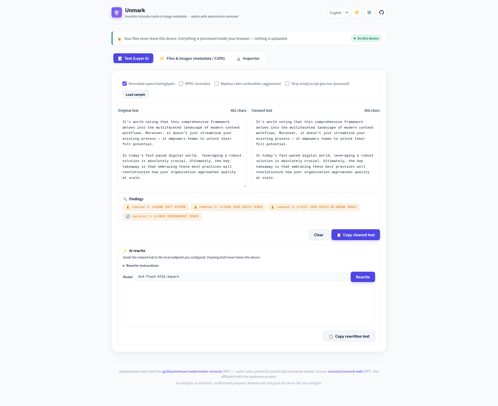
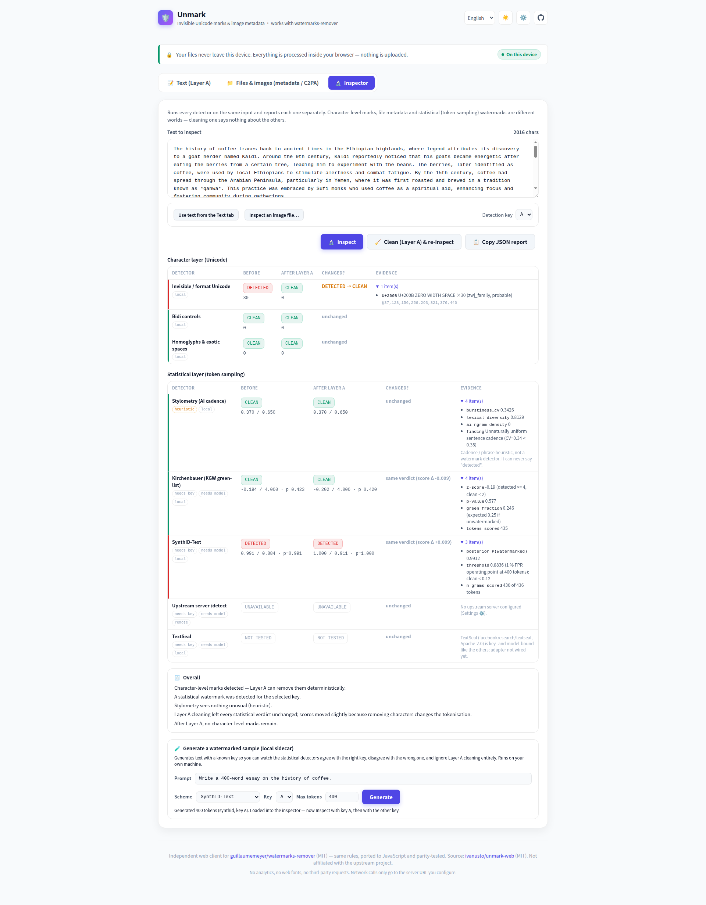

# Unmark (`unmark-web`)

[English](README.md) · [繁體中文](README.zh-TW.md)

> Renamed from `watermarks-remover-web` in August 2026, at the upstream maintainer's request, so it isn't mistaken for an official component. GitHub redirects the old repository URL; the demo moved to the address below.

**Removes the digital watermarks and provenance marks that AI tools leave on what they generate**: the invisible Unicode
characters hidden in text, and the C2PA, EXIF, XMP and ID3 metadata carried inside image, audio and video files. It also
tells you, honestly, which watermarks it cannot remove: statistical ones live in how tokens were sampled and pixel-domain
ones live in the image itself, so no metadata strip touches them. The Inspector tab tests for those separately.

Independent, browser-first web client for **[guillaumemeyer/watermarks-remover](https://github.com/guillaumemeyer/watermarks-remover)**, inspired by and compatible with its HTTP API. Not affiliated with the upstream project.

- **Runs entirely in the browser** for text (Layer A: invisible Unicode / homoglyph spaces) and PNG / JPEG / WebP / AVIF / HEIC / BMP / GIF / TIFF metadata (C2PA, EXIF, XMP, text chunks). No uploads, no analytics, no web fonts, no third-party requests.
- **Optionally drives the upstream Python service** (`server.py`) for everything else: PDF, DOCX, ODT, EPUB, full HTML/SVG/Markdown container cleaning, and pixel-domain backends.
- The JavaScript engines are **line-for-line ports of upstream's `text_unicode.py`, `image_meta.py`, `score_stylometry.py` and `detect_gumbel.py`**, and a parity test suite asserts identical output (same characters kept/stripped, same bytes out of the image parsers, same stylometry numbers, same keyed-Gumbel p-value).
- A **Watermark Inspector** tab runs every detector on one input and reports each separately across the character, metadata and statistical layers, and can re-run them after a Layer A clean to show what the cleaner did *not* touch. Keyed-Gumbel (EXP) detection runs in the page itself; the other statistical detectors (Kirchenbauer, SynthID-Text) run through an optional local sidecar.

Live demo: [https://ivanusto.github.io/unmark-web/](https://ivanusto.github.io/unmark-web/) · Local: open `index.html` or run `python3 serve_local.py`.

<picture>
  <source media="(prefers-color-scheme: dark)" srcset="docs/screenshot-dark.png">
  
</picture>

## What it does (and does not)

| Input | Browser engine | Server engine (`server.py`) |
| --- | --- | --- |
| Pasted text / `.txt` | Layer A: zero-width & bidi controls, variation selectors, tag chars, PUA, Unicode noncharacters, reserved default-ignorables, other `Cf`; space homoglyphs; optional NFKC / Latin confusables. Preserves load-bearing invisibles (emoji ZWJ/VS16, Persian/Indic ZWNJ, flag tags, Mongolian FVS, Khmer vowels, Hangul fillers, Arabic Cf, and layout format controls next to their own script: Egyptian quadrat, Duployan, musical beaming) exactly like upstream, with a "paranoid" toggle. | same |
| `.md` `.html` `.svg` | Layer A on the text only (metadata tags/frontmatter untouched, which the UI flags) | full container cleaning (frontmatter keys, `<meta generator>`, XMP, …) |
| PNG / JPEG / WebP / AVIF / HEIC | drops `tEXt/zTXt/iTXt/eXIf/caBX/c2*` chunks, `APPn` (except JFIF) + `COM` segments, `EXIF/XMP/ICCP/C2PA` RIFF chunks with VP8X flag fix-up, and `jumb/c2pa/uuid` ISOBMFF boxes plus their `meta` sub-boxes, covering both the XMP user type and C2PA's content-provenance user type `d8fec3d6-...`. Pixels are untouched (no canvas re-encode). "Keep non-AI metadata" mode only drops blocks with AI/C2PA hints. | same, plus optional pixel-domain backends if installed |
| BMP / GIF / TIFF | BMP: drops the trailing bytes after the pixel payload (the only place BMP metadata can live) and rewrites the file-size field. GIF: drops comment and XMP/unknown application extensions, keeping NETSCAPE2.0 looping and ICC. TIFF (classic and BigTIFF): walks the IFD chains and drops XMP/EXIF/GPS/IPTC/Photoshop/MakerNote tags, patching each IFD in place so strip and tile offsets stay valid. | same |
| PDF / DOCX / ODT / EPUB | no (needs server) | yes |
| MP4 / MOV / M4A / M4V / WAV / MP3 / FLAC | drops the `jumb/c2pa/uuid` ISOBMFF boxes an MP4 shares with AVIF and HEIC, plus `moov/udta` generator tags; WAV `C2PA`, `LIST INFO` and `id3 ` chunks; ID3v2 frames in MP3, and C2PA's `GEOB application/c2pa` frame in FLAC. Samples and frames are never touched. Read through `File.slice()`, so a long recording costs no more memory than a short one. | same |
| Statistical text watermarks (Kirchenbauer / KGW, SynthID-Text) | **detect only**, via the optional local [sidecar](sidecar/README.md) (needs a model and the generator's key); never removed, see upstream Layer B for rewriting | via upstream `/detect` (MarkLLM harness) when the server advertises text detectors |
| Pixel watermarks (SynthID image, …) | **no** | via upstream backends only |

Three consequences of the container rules that surprise people:

* **A cleaned AVIF or HEIC is the same size as the original.** A dropped ISOBMFF box is
  overwritten with an equal-size `free` box rather than spliced out, because closing the gap
  would shift every absolute media offset later in the file and break the image. The metadata
  really is gone: the `free` payload is zeroed.
* **A truncated file keeps its truncated tail.** If a download was interrupted, the last PNG
  chunk or ISOBMFF box declares more bytes than the file holds. That tail is copied through
  verbatim and reported as an action, so a recoverable image is not turned into an unopenable
  husk that claims it was already clean.
* **Audio and video never enter memory.** The clean tab reads box and chunk headers through
  `File.slice()` and hands the browser a `Blob` of slices of the original file, so a
  multi-gigabyte recording is cleaned without holding it. Only the metadata regions are read.
  The Inspector tab still reads its input whole and keeps the 64 MiB limit.

## Connecting a server

`server.py` binds to `127.0.0.1:8765`, sends **no CORS headers**, and may require a bearer token, all by design. Three ways to use it from this UI:

1. **`serve_local.py` (recommended)**: stdlib, loopback-only static server that proxies `/api/*` to `server.py`, so the browser talks same-origin:
   ```bash
   # terminal 1: upstream service
   python3 service/scripts/server.py                     # from the upstream checkout (or its Docker image)
   # terminal 2: this UI
   python3 serve_local.py --upstream http://127.0.0.1:8765 [--api-key "$WATERMARKS_SERVER_API_KEY"]
   # open http://127.0.0.1:8766/  → the UI auto-selects /api
   ```
2. **Any reverse proxy** that serves this directory and forwards a path to `server.py`; enter that path (e.g. `/api`) or URL in ⚙️ *Server connection*.
3. **Direct URL** (e.g. from the GitHub Pages build), which only works if something in front of the server allows this page's origin via CORS. Upstream deliberately ships **no** CORS support in `server.py` (the API is meant to be server-to-server; see [issue #77](https://github.com/guillaumemeyer/watermarks-remover/issues/77) and [PR #78](https://github.com/guillaumemeyer/watermarks-remover/pull/78)), so this means your own reverse proxy in front of it. Do **not** put a wildcard CORS header on the API.

The API key is only sent as `Authorization: Bearer …` to the URL you configured, and only stored in `localStorage` if you tick *Remember in this browser*.

## AI rewrite (optional, local only)

Cleaning strips the marks; it does not touch the prose. If you also want the text rewritten out of its AI cadence, `serve_local.py` can proxy an **OpenAI-compatible chat endpoint of your own**: a local model runner, or anything else you host:

```bash
# --llm-upstream  base URL, without the /v1 suffix
# --llm-model     optional; prefills the model field
# --llm-api-key   optional; stays server-side
python3 serve_local.py \
  --llm-upstream http://<your-llm-host>:<port> \
  --llm-model <model-id> \
  --llm-api-key "$YOUR_KEY"

# equivalently: UNMARK_LLM_URL / UNMARK_LLM_MODEL / UNMARK_LLM_API_KEY
```

A *Rewrite* panel then appears under the cleaned text, with an editable instruction prompt. It sends `POST /llm/v1/chat/completions` **same-origin**, so the key never enters the browser and the watermarks service's own bearer token is never attached to it.

Three things worth being explicit about:

- **It is off by default.** With no `--llm-upstream`, `/llm/*` answers 404 and the panel is not rendered at all.
- **The hosted build cannot offer it.** [The demo](https://ivanusto.github.io/unmark-web/) is HTTPS, and browsers block an HTTPS page from calling a plain-HTTP local endpoint. This is a `serve_local.py` feature by construction, not an oversight.
- **Cleaning stays offline; rewriting does not.** Text you rewrite is sent to the endpoint you configured. Everything on the *Text* and *Files* tabs is still processed in the page unless you connect a server.


## Watermark Inspector

The *Inspector* tab is a detection lab, deliberately separated from the cleaners. It runs every registered detector on the same input and shows one row per detector, grouped by layer:

| Layer | Detectors | Where it runs | What a hit means |
| --- | --- | --- | --- |
| **Character** | invisible / format Unicode, bidi controls, homoglyphs & exotic spaces | browser (`js/layer_a.js`) | deterministic: Layer A can strip it, and re-inspecting proves it |
| **Metadata** | C2PA / Content Credentials, XMP, EXIF / TIFF tags, AI-generator markers, other | browser (`js/image_meta.js`) | provenance or generator metadata is present in the container |
| **Statistical** | keyed-Gumbel / EXP, Kirchenbauer (KGW green-list), SynthID-Text, upstream `/detect`, TextSeal (placeholder), stylometry (heuristic) | browser (`js/gumbel.js`) / local sidecar / upstream server | the token sequence carries a sampling watermark **for the key you tested**, nothing more |

Every detector returns the same shape, and *Copy JSON report* exports exactly that:

```json
{ "detector": "synthid-text", "layer": "statistical",
  "status": "detected | clean | uncertain | unavailable | not_tested | not_applicable | error",
  "confidence": 0.97, "score": 0.97, "threshold": 0.93,
  "evidence": [{ "label": "posterior", "detail": "0.9712" }],
  "note": null, "requires_key": true, "requires_model": true, "local": true, "heuristic": false,
  "meta": { "model": "Qwen/Qwen3-4B-Instruct-2507", "key_profile": "a", "tokens": 412 } }
```

Three rules the UI enforces, because honesty is the feature:

- **Detector and cleaner are separate.** *Clean (Layer A) & re-inspect* runs the cleaner once and shows every detector before / after with a *changed?* column. When the statistical rows come back identical, the Overall box says so: *Layer A cleaning did not affect the statistical watermark detectors.*
- **A heuristic can never say "detected".** Stylometry (burstiness, MATTR, AI-phrase density, ported from upstream's `score_stylometry.py`) is capped at *uncertain* and labelled *heuristic* on the row.
- **"Unavailable" is not "clean".** Most statistical detectors need the generator's key, tokenizer and a model. On the hosted HTTPS page those report *unavailable*, and the Overall line says statistical watermarks were not tested there and cannot be ruled out. A *clean* is likewise scoped to the key and scheme you tested.

### Keyed-Gumbel (EXP), in the browser

The one statistical detector that needs no sidecar, no model weights and no network: a port of upstream's `detect_gumbel.py` into [`js/gumbel.js`](js/gumbel.js), with its own SHA-256 and HMAC so it runs synchronously and works from `file://` as well as from the hosted page. Open **Keyed-Gumbel (EXP) key** on the Inspector tab and paste the key the text was generated with (a passphrase, or `0x…` for raw bytes). The key is held in the page for the length of the run: it is never stored, never sent anywhere, and never written into the JSON report.

The detector replays the keyed sampler's noise from the text alone. For each position it derives `seed = HMAC(key, last H tokens)` and `u = HMAC(seed, token)`, sums `-log(1 - u)`, and compares that against the `Gamma(counted, 1)` distribution it would follow if nothing were watermarked. Repeated context windows are skipped, because the generator falls back to ordinary randomness when a window recurs.

Read the result the way upstream intends it:

- It is a **same-key replay**. It is valid only against the key, tokenizer and PRF layout used at generation, which in practice means a self-hosted engine you control.
- A **negative proves nothing**. Unwatermarked text, another provider's key and human writing all sit at chance, which is why the row says *not this key* rather than *no watermark*.
- The PRF layout is a **clean-room instantiation** of the scheme (HMAC-SHA256 over packed token ids), auditable but not bit-compatible with any particular engine's kernel. Exact replay against a real engine needs that engine's tokenizer and PRF.

The default context window is 4 tokens and the default verdict threshold is `p < 1e-6`; both are adjustable next to the key field. The score column shows `-log10(p)` against `-log10(threshold)`, so bigger is stronger evidence, and the exact p-value is the first evidence row.

### Statistical sidecar (optional, local only)

[`sidecar/unmark_stat.py`](sidecar/README.md) is a small Python service (PyTorch + 🤗 Transformers, GPU recommended) that scores text with the reference Kirchenbauer and SynthID-Text detectors from `transformers`, using **public experiment keys** and the independently trained SynthID Bayesian detectors from [`xlr8harder/synthid`](https://github.com/xlr8harder/synthid) (MIT) for `Qwen/Qwen3-4B-Instruct-2507`. It can also *generate* a watermarked sample with a chosen key, so you can run the demonstration end to end:

```bash
# terminal 1: the sidecar (first run downloads the model and detector bundles)
python -m venv sidecar/.venv && sidecar/.venv/bin/pip install -r sidecar/requirements.txt
sidecar/.venv/bin/python sidecar/unmark_stat.py            # 127.0.0.1:8767

# terminal 2: this UI, proxying /stat/* to it
python3 serve_local.py --stat-upstream http://127.0.0.1:8767
```

<picture>
  <source media="(prefers-color-scheme: dark)" srcset="docs/screenshot-inspector-dark.png">
  
</picture>

Then, in the Inspector: *Generate* with SynthID-Text and key **A** → *Inspect* with key A (detected) → switch to key **B** (clean / uncertain) → *Clean (Layer A) & re-inspect* (scores unchanged). Two worlds: the character layer goes to zero, the statistical layer does not move.

Limits, stated plainly: detection is only valid for the **same scheme, the same key and the same tokenizer** as generation; text from a model whose keys you do not hold cannot be judged, and the sidecar says *clean for this key*, never *not watermarked*. Like the rewrite panel, it is a `serve_local.py` feature, because the hosted page cannot reach a plain-HTTP loopback service.

## Development

```bash
python3 -m venv .venv && .venv/bin/pip install -r requirements-dev.txt
git clone https://github.com/guillaumemeyer/watermarks-remover ../watermarks-remover     # for parity tests
WATERMARKS_UPSTREAM_DIR=../watermarks-remover .venv/bin/pytest -q
node scripts/check-upstream.mjs                                                          # upstream hash drift
```

There is no `package.json` here, because nothing at runtime or in the test suite needs npm, so the upstream check runs straight through `node`, exactly as [the workflow](.github/workflows/upstream-check.yml) does. It exits `0` when the recorded hashes still match, `1` on drift, and `2` when it could not check at all (network, rate limit, bad manifest), so an unreachable source is never reported as drift.

- `js/layer_a.js`: port of `text_unicode.py` (`clean`, `inspect`, `decide`)
- `js/image_meta.js`: port of `image_meta.py` (PNG/JPEG/WebP/AVIF/HEIC/BMP/GIF/TIFF inspect + strip)
- `js/stylometry.js`: port of `score_stylometry.py` (burstiness / MATTR / AI-phrase density; heuristic, not a watermark detector)
- `js/gumbel.js`: port of `detect_gumbel.py` (keyed-Gumbel / EXP same-key replay, with its own synchronous SHA-256 and HMAC so it needs neither `crypto.subtle` nor a secure context)
- `js/detectors.js`: the Inspector's detector registry: one result contract for the character, metadata and statistical layers, plus `summarize()` / `compare()` for the Overall box and the before/after view
- `js/api.js`: client for `/health /capabilities /inspect /clean /detect`, plus the optional `/llm-config` + `/llm` rewrite calls and `/stat-config` + `/stat` sidecar calls
- `js/i18n.js`, `js/app.js`, `css/app.css`, `index.html`: UI (English / 繁體中文 / 简体中文, light/dark, keyboard-accessible). The locale is picked from `navigator.languages` and remembered in `localStorage`; adding a language is one entry in `LANGS` plus one dictionary in `js/i18n.js`.
- `tests/test_layer_a_parity.py`, `tests/test_image_meta_parity.py`, `tests/test_av_meta_parity.py`, `tests/test_stylometry_parity.py`, `tests/test_gumbel_parity.py`, `tests/test_contains_any_parity.py`, `tests/test_c2pa_prov_scan_parity.py`, `tests/test_finding_confidence_parity.py`: cross-engine parity vs the upstream checkout (skipped if `node` or the checkout is missing, so the suite is run with `-rs`)
- `tests/test_i18n_keys.py`: every locale carries every key, and every `data-i18n` attribute in `index.html` resolves. A gap there is invisible at runtime, because `t()` falls back silently.
- `serve_local.py`: same-origin static + `/api` proxy, the optional `/llm` rewrite proxy and the optional `/stat` sidecar proxy
- `sidecar/`: the statistical-detector sidecar (its own `requirements.txt`; never part of the page)
- `scripts/check-upstream.mjs`: run it with `node scripts/check-upstream.mjs`; hashes the upstream Python modules against `scripts/upstream-sources.json` (a source can carry a `slice` to track one definition instead of a whole file, for modules this project mirrors only part of); `.github/workflows/upstream-check.yml` runs it and the parity suite daily and files an issue when either signal fires. Parity catches behaviour that changed; the hashes catch changes the fixtures do not reach, such as a newly supported format.

No build step, no dependencies at runtime. CSP: `default-src 'self'; connect-src *` (the latter so you can point at your own server).

## Changelog

Full notes on each [release](https://github.com/ivanusto/unmark-web/releases).

### Unreleased

- **A PNG text chunk can no longer inflate without a bound.** [guillaumemeyer/watermarks-remover#308](https://github.com/guillaumemeyer/watermarks-remover/pull/308) caps a decompressed `zTXt`/`iTXt` value at 1 MiB, because a few hundred KB of crafted deflate expands to hundreds of megabytes and the marker scan then copies it again. `inspectPng` reports such a chunk as *not fully inspected* rather than leaving it out of the findings, and `stripPng` drops it even in keep mode: a chunk nobody could read is not a chunk anyone can vouch for. The same change also means a text chunk whose deflate stream stops early is scanned as far as it decoded, instead of being discarded whole.
- **A truncated ID3v2 tag is reported, and the audio survives it.** [guillaumemeyer/watermarks-remover#201](https://github.com/guillaumemeyer/watermarks-remover/pull/201): an MP3 whose tag header declares more tag than the file holds used to parse to nothing and be reported clean. It is now reported as truncated, with whatever markers the surviving bytes carry, and a clean drops the unreadable tag up to the first valid MPEG frame header. A file with no such header to find is preserved exactly as it was rather than emptied. Both drivers carry it, and the slice driver finds the frame header without reading the file into memory.
- New parity anchors: `image_meta.py` `bd5d9f19f370`, `av_meta.py` `f012ed17276c`.

### [v0.6.1](https://github.com/ivanusto/unmark-web/releases/tag/v0.6.1)

- **The explanation moved below the tool.** v0.6.0 put it above, which pushed the textarea off the first screen: someone who came here to clean a file had to scroll past a description of the file to reach it. It now sits under the tab panels as an "About Unmark" section, separated by a rule, with the same three cards and the same weight on the caveat.
- The three card icons are gone. The ochre rule on the caveat card carries the emphasis on its own.

### [v0.6.0](https://github.com/ivanusto/unmark-web/releases/tag/v0.6.0)

- **The page now says what the tool is for.** A visitor landing on the demo got a one-line tagline and a row of tabs. There is now a lead paragraph and three cards above the fold: what it removes, **what it cannot remove**, and why the output can be trusted. The middle card gets the same weight as the other two rather than being a footnote, because "the metadata is gone" and "the watermark is gone" are different claims and that difference is the whole reason the Inspector tab exists. Title, meta description and tagline lead with watermark removal instead of describing the file formats.
- **Morandi palette, light and dark.** Low-saturation, grey-leaning hues on a warm neutral ground: eucalyptus accent, sage, ochre and faded terracotta for status, unbleached linen or warm charcoal for the page. Every colour now comes from a token, including the thirteen that were written out by hand in rules across the stylesheet.
- **The palette's accessibility claim is tested, not asserted.** `tests/test_theme_contrast.py` parses the tokens out of `css/app.css` and checks that every text and badge colour clears WCAG AA (4.5:1) against each background it can sit on, in both themes, compositing the translucent card colour over the page first. It also fails if the light theme forgets to override a colour token, which would silently leave a dark-theme value on a pale ground.
- The tagline is hidden below 560px, where it wrapped to five lines and pushed the header controls off the row.

### [v0.5.0](https://github.com/ivanusto/unmark-web/releases/tag/v0.5.0)

- **C2PA manifests in AVIF, HEIC, MP4 and MOV are recognized by user type, not by a substring.** C2PA stores its manifest in a BMFF container as a top-level `uuid` box whose user type is `d8fec3d6-1b0e-483c-9297-5828877ec481`, not as a `c2pa` box. This port special-cased XMP's user type and otherwise looked for ASCII `c2pa`/`jumb` in the payload, so a manifest carrying neither (an auxiliary `merkle` box, a binary manifest store) was caught by luck in strip-all mode and missed entirely in "keep non-AI metadata" mode. Ported from upstream #264, with the equal-size `free` replacement unchanged, so a cleaned file still keeps its length and its media offsets.
- **Stylometry no longer scores a sample it cannot measure.** Below the 30-word calibration floor the score and confidence level are absent rather than `0.0` / `CLEAN`, and the Inspector says the sample was too short instead of showing a dash. Every report also carries a `density_tier`, and the marker table gained twenty patterns. Ported from upstream #258.
- **A Layer A space homoglyph is informational, not probable** (upstream #273), in the finding-confidence helper this port mirrors from upstream's `common.py`.
- **The drift check can now track a single definition.** `common.py` is not ported wholesale, only `classify_finding_confidence`, so hashing the whole file would have filed an issue every time upstream touched anything else. A source in `scripts/upstream-sources.json` can now carry a `slice`, and `common.py` is tracked that way. Before this, the #273 change was invisible here.
- **CI was grading someone else's suite.** `pytest -q` ran from the repo root, where the workflow also checks out `upstream/`, so the verdict included upstream's own tests. Both workflows now run `pytest tests/ -q -rs`, the `-rs` because a parity file that skips itself when it cannot find its upstream module is otherwise a silent pass.
- New parity anchors: `image_meta.py` `360da6bac49f`, `score_stylometry.py` `57dcbd2cb1ec`, and `common.py` tracked by slice.

### [v0.4.2](https://github.com/ivanusto/unmark-web/releases/tag/v0.4.2)

- **The UI now says it handles audio and video.** The engines have cleaned and inspected MP4/MOV/M4A/M4V, MP3, WAV and FLAC since v0.4.0 and the file pickers accepted them, but the tagline, the Files tab label, both dropzone descriptions, the Inspector's button and empty state, and the meta description all still described an image tool. Nine strings across all three locales, plus the two stale inline English fallbacks in `index.html`.
- **Corrected a claim that predates audio and video.** The server engine description said images were still handled on this device. Every dropped file goes to the server when one is connected; only text pasted into the Text tab stays local.

### [v0.4.1](https://github.com/ivanusto/unmark-web/releases/tag/v0.4.1)

- **The truncated-MP4 divergence is gone: upstream took the same fix.** [guillaumemeyer/watermarks-remover#242](https://github.com/guillaumemeyer/watermarks-remover/pull/242) landed the tail-preserving rewrite this port already had, so `tests/test_av_meta_parity.py` now asserts the two agree instead of asserting they differ. #242 also added an `inspection_incomplete` flag that `clean_av` folds into `still_has_ai_metadata`; `cleanAv` and `cleanAvFile` carry it as `inspectionIncomplete`, and a truncated file is reported as unverified rather than clean.
- New parity anchor: `av_meta.py` `579b01cbac34`.

### [v0.4.0](https://github.com/ivanusto/unmark-web/releases/tag/v0.4.0)

- **Audio and video** (`js/av_meta.js`, port of upstream's `av_meta.py`): MP4/MOV/M4A/M4V, WAV, MP3 and FLAC, in the browser. MP4 reuses the ISOBMFF box walker that already backs AVIF and HEIC.
- **Cleaning a video does not mean holding it.** The engine ships two drivers over the same primitives: a whole-buffer one the parity suite checks against upstream, and a slice driver that walks headers through `File.slice()` and returns a `Blob` of slices of the original file. On a 128 MB MP4 it reads 0.32 KB and produces byte-identical output. The 64 MiB browser limit no longer applies to audio and video.
- **A truncated MP4 keeps its media.** Upstream's `_strip_moov_udta` rebuilds the file from the boxes that parsed and drops the rest, while the action list says the tail was kept; this port keeps it, as upstream #182 already established for PNG and ISOBMFF. Reported as [guillaumemeyer/watermarks-remover#240](https://github.com/guillaumemeyer/watermarks-remover/issues/240) and recorded in `scripts/upstream-sources.json` until it lands.
- The Inspector reports audio and video findings through the same metadata detectors, and now refuses files above its own limit instead of reading them anyway.
- New parity anchor: `av_meta.py` `992981922d27`.

### [v0.3.1](https://github.com/ivanusto/unmark-web/releases/tag/v0.3.1)

- **Emoji presentation selectors after five more bases** (upstream #200): `U+203C`, `U+2049`, `U+2139`, `U+2934` and `U+2935` are Emoji=Yes but sit outside the block ranges the base test covered, so a VS16 after them was stripped and the emoji reverted to its text glyph.
- **Benign JPEG comments survive keep mode** (upstream #216): a `COM` segment is unkeyed free text, so it is now dropped only when *Remove all metadata* is on or the comment actually carries a provenance marker. `Generated by ImageMagick` and `Claude Monet` are comment prose, not evidence.
- **The whole-file C2PA byte scan for JPEG is narrower** (same change): `jumb` and the XMP InstanceID namespace occur in ordinary files, so neither promotes a JPEG to C2PA on its own any more. Inside a parsed APP segment they still count.
- **The marker scanner no longer builds a string of the whole file.** `containsAny` walks the bytes directly behind a first-byte dispatch table. On a 24 MB HEIC, the inspect, clean and re-inspect pass the app performs went from 2936 ms to 121 ms, with identical output. `tests/test_contains_any_parity.py` pins it against upstream `_contains_any`.
- Parity anchors moved to `text_unicode.py` `ed86ed9715f4` and `image_meta.py` `3bde868717f5`.

### [v0.3.0](https://github.com/ivanusto/unmark-web/releases/tag/v0.3.0)

- **Keyed-Gumbel (EXP) detection in the browser** (`js/gumbel.js`, port of upstream's `detect_gumbel.py`). The first statistical detector that needs no sidecar, no model weights and no network, so it reaches a verdict on the hosted page. It is a same-key replay: `clean` means *not this key*, never *no watermark*.
- **Layer A hardening** (upstream #133): `U+180F`, `U+3164` and `U+FFA0` are kept next to their own script and stripped when they float; Unicode noncharacters and reserved default-ignorables are now strip-class; visible-layout format controls (Egyptian quadrat, Duployan, musical beaming) are kept next to their own script.
- **Image containers** (upstream #176, #182, #183): a dropped ISOBMFF box is overwritten with an equal-size `free` box, so a cleaned AVIF or HEIC keeps its length and later media offsets stay valid; a truncated PNG chunk or ISOBMFF box keeps its tail instead of being dropped while the run claims the file was already clean.
- Parity anchors moved to `text_unicode.py` `ab0197b06263`, `image_meta.py` `78e5a67db243`, and the new `detect_gumbel.py` `f908272084cd`.

### [v0.2.0](https://github.com/ivanusto/unmark-web/releases/tag/v0.2.0)

- **Watermark Inspector**: a third tab that runs every detector on one input and reports each separately across the character, metadata and statistical layers, through one result contract (`js/detectors.js`).
- **Stylometry** (`js/stylometry.js`, port of `score_stylometry.py`), capped at *uncertain* because a heuristic is not a watermark detector.
- **Statistical sidecar** (`sidecar/unmark_stat.py`): Kirchenbauer/KGW and SynthID-Text detection with the reference `transformers` detectors, proxied same-origin by `serve_local.py --stat-upstream`. Local only, off by default.

### [v0.1.0](https://github.com/ivanusto/unmark-web/releases/tag/v0.1.0)

First release. Layer A text cleaning and image container cleaning in the browser, three locales, an optional local AI rewrite behind `serve_local.py`, and the parity suite that pins both engines to upstream.

## Attribution & license

MIT, see [LICENSE](LICENSE). The character tables, decision rules and container parsers are derived from watermarks-remover, © watermarks-remover contributors, MIT; the upstream notice is preserved in [NOTICE](NOTICE). Use on content you own or are authorised to modify; see upstream's [ethics notes](https://github.com/guillaumemeyer/watermarks-remover/blob/main/skills/remove-ai-marks/references/ethics.md).
