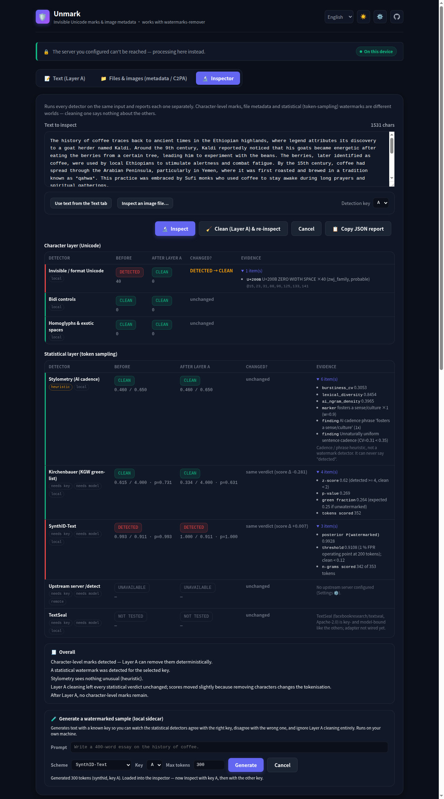

# Unmark (`unmark-web`)

[English](README.md) · [繁體中文](README.zh-TW.md)

> Renamed from `watermarks-remover-web` in August 2026, at the upstream maintainer's request, so it isn't mistaken for an official component. GitHub redirects the old repository URL; the demo moved to the address below.

Independent, browser-first web client for **[guillaumemeyer/watermarks-remover](https://github.com/guillaumemeyer/watermarks-remover)** — inspired by and compatible with its HTTP API. Not affiliated with the upstream project.

- **Runs entirely in the browser** for text (Layer A: invisible Unicode / homoglyph spaces) and PNG / JPEG / WebP / AVIF / HEIC / BMP / GIF / TIFF metadata (C2PA, EXIF, XMP, text chunks). No uploads, no analytics, no web fonts, no third-party requests.
- **Optionally drives the upstream Python service** (`server.py`) for everything else — PDF, DOCX, ODT, EPUB, full HTML/SVG/Markdown container cleaning, and pixel-domain backends.
- The JavaScript engines are **line-for-line ports of upstream's `text_unicode.py`, `image_meta.py` and `score_stylometry.py`**, and a parity test suite asserts identical output (same characters kept/stripped, same bytes out of the image parsers, same stylometry numbers).
- A **Watermark Inspector** tab runs every detector on one input and reports each separately — character layer, metadata layer, statistical layer — and can re-run them after a Layer A clean to show what the cleaner did *not* touch. Statistical detectors (Kirchenbauer, SynthID-Text) run through an optional local sidecar.

Live demo: [https://ivanusto.github.io/unmark-web/](https://ivanusto.github.io/unmark-web/) · Local: open `index.html` or run `python3 serve_local.py`.

<picture>
  <source media="(prefers-color-scheme: dark)" srcset="docs/screenshot-dark.png">
  
</picture>

## What it does (and does not)

| Input | Browser engine | Server engine (`server.py`) |
| --- | --- | --- |
| Pasted text / `.txt` | Layer A: zero-width & bidi controls, variation selectors, tag chars, PUA, other `Cf`; space homoglyphs; optional NFKC / Latin confusables. Preserves load-bearing invisibles (emoji ZWJ/VS16, Persian/Indic ZWNJ, flag tags, Mongolian FVS, Khmer vowels, Hangul fillers, Arabic Cf) exactly like upstream, with a "paranoid" toggle. | same |
| `.md` `.html` `.svg` | Layer A on the text only (metadata tags/frontmatter untouched — flagged in the UI) | full container cleaning (frontmatter keys, `<meta generator>`, XMP, …) |
| PNG / JPEG / WebP / AVIF / HEIC | drops `tEXt/zTXt/iTXt/eXIf/caBX/c2*` chunks, `APPn` (except JFIF) + `COM` segments, `EXIF/XMP/ICCP/C2PA` RIFF chunks with VP8X flag fix-up, and `jumb/c2pa/uuid` (XMP) ISOBMFF boxes plus their `meta` sub-boxes. Pixels are untouched (no canvas re-encode). "Keep non-AI metadata" mode only drops blocks with AI/C2PA hints. | same, plus optional pixel-domain backends if installed |
| BMP / GIF / TIFF | BMP: drops the trailing bytes after the pixel payload (the only place BMP metadata can live) and rewrites the file-size field. GIF: drops comment and XMP/unknown application extensions, keeping NETSCAPE2.0 looping and ICC. TIFF (classic and BigTIFF): walks the IFD chains and drops XMP/EXIF/GPS/IPTC/Photoshop/MakerNote tags, patching each IFD in place so strip and tile offsets stay valid. | same |
| PDF / DOCX / ODT / EPUB | — (needs server) | yes |
| Statistical text watermarks (Kirchenbauer / KGW, SynthID-Text) | **detect only**, via the optional local [sidecar](sidecar/README.md) (needs a model and the generator's key); never removed — see upstream Layer B for rewriting | via upstream `/detect` (MarkLLM harness) when the server advertises text detectors |
| Pixel watermarks (SynthID image, …) | **no** | via upstream backends only |

## Connecting a server

`server.py` binds to `127.0.0.1:8765`, sends **no CORS headers**, and may require a bearer token — by design. Three ways to use it from this UI:

1. **`serve_local.py` (recommended)** — stdlib, loopback-only static server that proxies `/api/*` to `server.py`, so the browser talks same-origin:
   ```bash
   # terminal 1: upstream service
   python3 service/scripts/server.py                     # from the upstream checkout (or its Docker image)
   # terminal 2: this UI
   python3 serve_local.py --upstream http://127.0.0.1:8765 [--api-key "$WATERMARKS_SERVER_API_KEY"]
   # open http://127.0.0.1:8766/  → the UI auto-selects /api
   ```
2. **Any reverse proxy** that serves this directory and forwards a path to `server.py`; enter that path (e.g. `/api`) or URL in ⚙️ *Server connection*.
3. **Direct URL** (e.g. from the GitHub Pages build) — only works if something in front of the server allows this page's origin via CORS. Upstream deliberately ships **no** CORS support in `server.py` (the API is meant to be server-to-server; see [issue #77](https://github.com/guillaumemeyer/watermarks-remover/issues/77) and [PR #78](https://github.com/guillaumemeyer/watermarks-remover/pull/78)), so this means your own reverse proxy in front of it. Do **not** put a wildcard CORS header on the API.

The API key is only sent as `Authorization: Bearer …` to the URL you configured, and only stored in `localStorage` if you tick *Remember in this browser*.

## AI rewrite (optional, local only)

Cleaning strips the marks; it does not touch the prose. If you also want the text rewritten out of its AI cadence, `serve_local.py` can proxy an **OpenAI-compatible chat endpoint of your own** — a local model runner, or anything else you host:

```bash
# --llm-upstream  base URL, without the /v1 suffix
# --llm-model     optional; prefills the model field
# --llm-api-key   optional; stays server-side
python3 serve_local.py \
  --llm-upstream http://<your-llm-host>:<port> \
  --llm-model <model-id> \
  --llm-api-key "$YOUR_KEY"

# equivalently: UNMARK_LLM_URL / UNMARK_LLM_MODEL / UNMARK_LLM_API_KEY
```

A *Rewrite* panel then appears under the cleaned text, with an editable instruction prompt. It sends `POST /llm/v1/chat/completions` **same-origin**, so the key never enters the browser and the watermarks service's own bearer token is never attached to it.

Three things worth being explicit about:

- **It is off by default.** With no `--llm-upstream`, `/llm/*` answers 404 and the panel is not rendered at all.
- **The hosted build cannot offer it.** [The demo](https://ivanusto.github.io/unmark-web/) is HTTPS, and browsers block an HTTPS page from calling a plain-HTTP local endpoint. This is a `serve_local.py` feature by construction, not an oversight.
- **Cleaning stays offline; rewriting does not.** Text you rewrite is sent to the endpoint you configured. Everything on the *Text* and *Files* tabs is still processed in the page unless you connect a server.


## Watermark Inspector

The *Inspector* tab is a detection lab, deliberately separated from the cleaners. It runs every registered detector on the same input and shows one row per detector, grouped by layer:

| Layer | Detectors | Where it runs | What a hit means |
| --- | --- | --- | --- |
| **Character** | invisible / format Unicode, bidi controls, homoglyphs & exotic spaces | browser (`js/layer_a.js`) | deterministic — Layer A can strip it, and re-inspecting proves it |
| **Metadata** | C2PA / Content Credentials, XMP, EXIF / TIFF tags, AI-generator markers, other | browser (`js/image_meta.js`) | provenance or generator metadata is present in the container |
| **Statistical** | Kirchenbauer (KGW green-list), SynthID-Text, upstream `/detect`, TextSeal (placeholder), stylometry (heuristic) | local sidecar / upstream server / browser | the token sequence carries a sampling watermark **for the key you tested** — nothing more |

Every detector returns the same shape, and *Copy JSON report* exports exactly that:

```json
{ "detector": "synthid-text", "layer": "statistical",
  "status": "detected | clean | uncertain | unavailable | not_tested | not_applicable | error",
  "confidence": 0.97, "score": 0.97, "threshold": 0.93,
  "evidence": [{ "label": "posterior", "detail": "0.9712" }],
  "note": null, "requires_key": true, "requires_model": true, "local": true, "heuristic": false,
  "meta": { "model": "Qwen/Qwen3-4B-Instruct-2507", "key_profile": "a", "tokens": 412 } }
```

Three rules the UI enforces, because honesty is the feature:

- **Detector and cleaner are separate.** *Clean (Layer A) & re-inspect* runs the cleaner once and shows every detector before / after with a *changed?* column. When the statistical rows come back identical, the Overall box says so: *Layer A cleaning did not affect the statistical watermark detectors.*
- **A heuristic can never say "detected".** Stylometry (burstiness, MATTR, AI-phrase density — upstream's `score_stylometry.py`, ported) is capped at *uncertain* and labelled *heuristic* on the row.
- **"Unavailable" is not "clean".** Statistical detectors need the generator's key, tokenizer and a model. On the hosted HTTPS page they report *unavailable* and the Overall line reads *Statistical watermarks were not tested here — they cannot be ruled out.* A *clean* from the sidecar is likewise scoped to the key and scheme you tested.

### Statistical sidecar (optional, local only)

[`sidecar/unmark_stat.py`](sidecar/README.md) is a small Python service (PyTorch + 🤗 Transformers, GPU recommended) that scores text with the reference Kirchenbauer and SynthID-Text detectors from `transformers`, using **public experiment keys** and the independently trained SynthID Bayesian detectors from [`xlr8harder/synthid`](https://github.com/xlr8harder/synthid) (MIT) for `Qwen/Qwen3-4B-Instruct-2507`. It can also *generate* a watermarked sample with a chosen key, so you can run the demonstration end to end:

```bash
# terminal 1: the sidecar (first run downloads the model and detector bundles)
python -m venv sidecar/.venv && sidecar/.venv/bin/pip install -r sidecar/requirements.txt
sidecar/.venv/bin/python sidecar/unmark_stat.py            # 127.0.0.1:8767

# terminal 2: this UI, proxying /stat/* to it
python3 serve_local.py --stat-upstream http://127.0.0.1:8767
```



Then, in the Inspector: *Generate* with SynthID-Text and key **A** → *Inspect* with key A (detected) → switch to key **B** (clean / uncertain) → *Clean (Layer A) & re-inspect* (scores unchanged). Two worlds: the character layer goes to zero, the statistical layer does not move.

Limits, stated plainly: detection is only valid for the **same scheme, the same key and the same tokenizer** as generation; text from a model whose keys you do not hold cannot be judged, and the sidecar says *clean for this key*, never *not watermarked*. Like the rewrite panel, it is a `serve_local.py` feature — the hosted page cannot reach a plain-HTTP loopback service.

## Development

```bash
python3 -m venv .venv && .venv/bin/pip install -r requirements-dev.txt
git clone https://github.com/guillaumemeyer/watermarks-remover ../watermarks-remover     # for parity tests
WATERMARKS_UPSTREAM_DIR=../watermarks-remover .venv/bin/pytest -q
node scripts/check-upstream.mjs                                                          # upstream hash drift
```

There is no `package.json` here — nothing at runtime or in the test suite needs npm, so the upstream check runs straight through `node`, exactly as [the workflow](.github/workflows/upstream-check.yml) does. It exits `0` when the recorded hashes still match, `1` on drift, and `2` when it could not check at all (network, rate limit, bad manifest) — an unreachable source is never reported as drift.

- `js/layer_a.js` — port of `text_unicode.py` (`clean`, `inspect`, `decide`)
- `js/image_meta.js` — port of `image_meta.py` (PNG/JPEG/WebP/AVIF/HEIC/BMP/GIF/TIFF inspect + strip)
- `js/stylometry.js` — port of `score_stylometry.py` (burstiness / MATTR / AI-phrase density; heuristic, not a watermark detector)
- `js/detectors.js` — the Inspector's detector registry: one result contract for the character, metadata and statistical layers, plus `summarize()` / `compare()` for the Overall box and the before/after view
- `js/api.js` — client for `/health /capabilities /inspect /clean /detect`, plus the optional `/llm-config` + `/llm` rewrite calls and `/stat-config` + `/stat` sidecar calls
- `js/i18n.js`, `js/app.js`, `css/app.css`, `index.html` — UI (English / 繁體中文 / 简体中文, light/dark, keyboard-accessible). The locale is picked from `navigator.languages` and remembered in `localStorage`; adding a language is one entry in `LANGS` plus one dictionary in `js/i18n.js`.
- `tests/test_layer_a_parity.py`, `tests/test_image_meta_parity.py`, `tests/test_stylometry_parity.py` — cross-engine parity vs the upstream checkout (skipped if `node` or the checkout is missing)
- `serve_local.py` — same-origin static + `/api` proxy, the optional `/llm` rewrite proxy and the optional `/stat` sidecar proxy
- `sidecar/` — the statistical-detector sidecar (its own `requirements.txt`; never part of the page)
- `scripts/check-upstream.mjs` — run it with `node scripts/check-upstream.mjs`; hashes the upstream Python modules against `scripts/upstream-sources.json`; `.github/workflows/upstream-check.yml` runs it and the parity suite daily and files an issue when either signal fires. Parity catches behaviour that changed; the hashes catch changes the fixtures do not reach, such as a newly supported format.

No build step, no dependencies at runtime. CSP: `default-src 'self'; connect-src *` (the latter so you can point at your own server).

## Attribution & license

MIT — see [LICENSE](LICENSE). The character tables, decision rules and container parsers are derived from watermarks-remover, © watermarks-remover contributors, MIT; the upstream notice is preserved in [NOTICE](NOTICE). Use on content you own or are authorised to modify — see upstream's [ethics notes](https://github.com/guillaumemeyer/watermarks-remover/blob/main/skills/remove-ai-marks/references/ethics.md).
